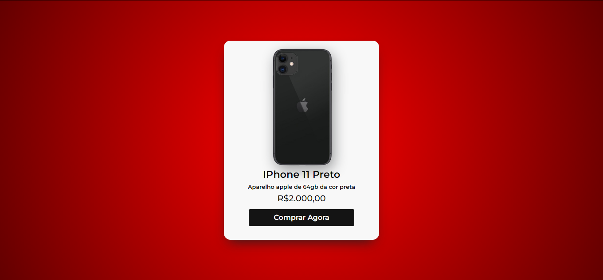

# Page Card Interativo

Bem-vindo ao repositório do *Card Interativo*! Este projeto foi criado através de um codigo-fonte base e modificado de acordo com meus gostos e ideias.

## 📋 Descrição

Este repositório contém o código-fonte do Card Interativo, card interativo, moderno e responsivo, ideal para promover pordutos e gerar novas vendas, 
com uma interação atraente para os clientes. A página inclui:

- *Design Responsivo*: Compatível com diferentes dispositivos e tamanhos de tela.
- Atratividade*: Inclui interação para destacar características e chamadas para ação.

## 🚀 Funcionalidades

- Layout adaptável que pode ser personalizado e implantado em qualquer site.

## 🔧 Tecnologias Utilizadas

- *HTML5*: Estrutura da página.
- *CSS3*: Estilização e design responsivo.

## 🔗 Links Úteis

- *Instagram*: https://www.instagram.com/artedasredes/
- *Contato*: artedasredes@gmail.com
- *Link para acessar o site*: 
